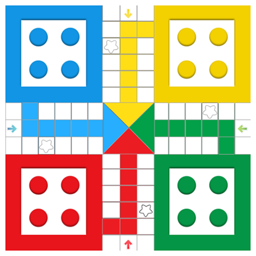

# JS Ludo

A vanilla Javascript Ludo game

## Reference Game Board Image

## TODO
- Allow the user to enter the "home stretch"
- Allow the user to take opposing pieces
- Add a valid html space for the center square
- Fix overlapping game pieces
- Animation for dice
- Animation for player indicator
- Animate pieces
- Complete check for winner

## Pseudo Code Plan
~~1. Create a game board~~

1. Assume 2 players for now hard coded as yellow and red
2. 4 Pieces are created for each player in the starting squares
3. While no one has all 4 pieces in the winning position each player takes turns rolling the dice.

### If a player has no pieces in play:
    - Their turn ends

### If a player rolls a 6:
    - If they have pieces at "home" they can bring these inplay and their turn is over
    - OR: They can also move a piece 6 moves and get another roll.

### If a player moves their piece onto a square already occupied:
    - If not a "safe square" and not occupied by 2 or more opponents:
    - They can take that piece out of play and send it home

### If a player lands on their "turn square"
    - Their piece is set to in "home strech"
    - Their position is then set to 1 - 6

## Data Structure

### Game Object
    - Stores the pieces
    - Stores amount of players
    - Stores whos turn it is
    - Stores "safe square" positions

### Piece Object
    - Stores the position
    - Stores the team
    - Stores if in play
    - Stores if on home stretch
    - Stores if piece has finished the board

### Player Object
    - Stores starting position on board
    - Stores end position on board

## Game Board Logic

### Game Board
    - 51 Total Squares + 6 additional squares for home steps

### Team Squares

    - Yellow
        - Starts: 0
        - Turns: 50
        - Ends: 50 + 6
    - Green
        - Starts: 13
        - Turns: 11
        - Ends: 11 + 6
    - Red
        - Starts: 26
        - Turns: 24
        - Ends: 24 + 6
    - Blue
        - Starts: 39
        - Turns: 37
        - Ends: 37 + 6

### Safe Squares
    - Green Side: 8
    - Red Side: 21
    - Blue Side: 34
    - Yellow Side: 47